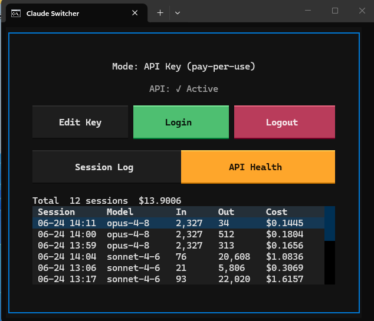

# Claude Switcher (Claude Code Auth Switcher)

A minimal Windows TUI (Terminal User Interface) tool to instantly toggle the **Claude Code CLI** between **API Key mode** (pay-per-use billing) and **Subscription / OAuth mode** (Claude Pro membership), with automatic API cost and token tracking.

---

## 💡 Why Claude Switcher? (The Pain Points)

### 1. The Cost vs. Quota Dilemma
* **Subscription Mode (OAuth)**: Included in your $20/month Claude Pro plan, but subject to strict **rate and message limits**. When working on complex codebase refactoring or submitting large context files, you will frequently hit `Quota Exceeded` limits, halting your development.
* **API Key Mode (Pay-per-use)**: Charged based on token consumption with virtually no usage limits. Excellent for heavy coding sessions, but running routine chit-chat or quick questions under this mode can quickly result in high, unnecessary API costs.

### 2. Manual Switching is Tedious
Switching between these modes on Windows manually requires you to:
1. Dig into the Registry or Windows System Properties to add/delete the global `ANTHROPIC_API_KEY` environment variable.
2. Manually edit `~/.claude/settings.json` to configure environment settings.
3. Restart all running terminal windows and the Claude Desktop Client.

**Claude Switcher handles all of this in a single click!**

---

## 📸 Interface Preview

  

  <em>(Sleek TUI interface running in Windows Terminal, featuring interactive buttons and live API connectivity diagnostics)</em>

---

## ✨ Core Features

* **⚡ Instant Toggle**: Switch to "Login (API Key mode)" or "Logout (Subscription mode)" in one click. The tool automatically updates system environment variables, patches configuration files, and restarts active Claude processes.
* **📊 Usage & Cost Monitoring**: Automatically registers a `Stop Hook` to calculate and log input/output token metrics and cost for each CLI session, instantly displaying them in a TUI history table.
* **🧠 Smart AI Agent Integration**:
  * **Claude Code**: Inject auto-delegation instructions into `CLAUDE.md` to guide the desktop client to run heavy code editing tasks through the pay-per-use CLI backend, protecting your subscription quota.
  * **Antigravity 2.0+**: Automatically updates global `AGENTS.md` rules with the local CLI path and active mode settings.
* **🔍 Connection Diagnostics**: A one-click test button to probe Anthropic API connectivity and validate the saved API Key.
* **🛠️ Zero-Config Setup**: Run `setup.bat` once to auto-detect your local Claude CLI installation path and register it to your user `PATH` (no manual configuration required).

---

## 🚀 Quick Start

### Requirements
* **OS**: Windows 10 or 11
* **Runtime**: Python 3.10+
* **Prerequisites**: [Claude Code](https://claude.ai/download) CLI installed

### Step 1: Initialize Setup
Double-click **`setup.bat`** in the project folder. This will automatically:
1. Verify Python and install required dependencies (like `Textual`).
2. Search your local filesystem for the installed Claude CLI (`claude.exe`).
3. Add the discovered CLI folder to your user's system `PATH` (restart terminal for changes to apply).

### Step 2: Launch the Switcher
Double-click **`run.bat`** to start the TUI application.

### Step 3: Configure & Toggle
1. **Enter API Key**: Click **`Edit API Key`**, input your Anthropic API Key, and save (stored locally in `config.json`, which is excluded from git).
2. **Switch to API Billing**: Click **`Login (API Key mode)`**. This will configure environment variables and inject instructions to delegate tasks to the CLI.
3. **Switch to OAuth/Subscription**: Click **`Logout (Subscription mode)`**. This will clear environment variables and restore default Claude Pro subscription limits.
4. **Track Cost**: Watch the session table at the bottom auto-refresh with your token consumption and spend after running CLI sessions.

---

## 🛠️ Architecture & File Breakdown

* **`app.py`**: Main TUI application built with Textual.
* **`usage_summary.py`**: Registered as a CLI stop hook to extract and calculate session tokens, saving records to local history.
* **`config.json`** (auto-generated): Caches the encrypted API Key and discovered local path to `claude.exe`.
* **`usage_history.json`** (auto-generated): Stores your local session usage logs.

---

## 📝 Agent Collaboration Guidance

This project integrates seamlessly with AI coding agents:
* When **API Key Mode** is active, the tool writes rules to `~/.claude/CLAUDE.md` and `~/.gemini/config/agents/AGENTS.md`.
* These instructions guide both the **Claude Desktop Client** and the **Antigravity Coding Assistant** to delegate self-contained tasks to the CLI sub-process. This ensures heavy refactoring runs on pay-per-use credits, keeping your conversational subscription quota free.

---

## 📄 License

This project is licensed under the [MIT License](LICENSE).
